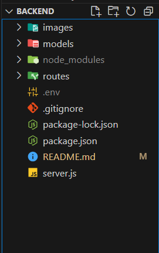

# Condor Market - Backend

Welcome to the Condor Market backend project. This README will guide you through the installation and setup process.

## Table of Contents

- [Condor Market - Backend](#condor-market---backend)
  - [Table of Contents](#table-of-contents)
  - [Introduction](#introduction)
  - [Prerequisites](#prerequisites)
  - [Installation](#installation)
  - [Project Directory Structure](#project-directory-structure)
  - [Running the Project](#running-the-project)

## Introduction

Condor Market is an ecommerce platform. This repository contains the backend code, which handles API requests, database interactions, authentication, and other server-side functionalities.

## Prerequisites

Make sure you have the following installed on your local machine:

- [Node.js](https://nodejs.org/) (version 14 or higher)
- [npm](https://www.npmjs.com/) (Node package manager)
- [MongoDB](https://www.mongodb.com/) (for the database)

## Installation

Follow these steps to install and set up the project on your local machine:

1. **Clone the repository:**

    ```sh
    git clone https://github.com/Nitin2806/CondorMarket-Backend.git
    cd CondorMarket-Backend
    ```

2. **Install dependencies:**

    ```sh
    npm install
    ```

3. **Create a `.env` file:**

    In the root directory of the project, create a file named `.env`. This file will contain all the necessary environment variables.

4. **Add environment variables:**

    Open the `.env` file and add the following variables. Replace the placeholder values with your actual configuration:

    ```plaintext
    PORT=3000
    MONGODB_URI=your mongodb project url
    JWT_SECRET=your jwt secret key
    ```
## Project Directory Structure



## Running the Project

To start the server, run the following command:

```sh
npm start
